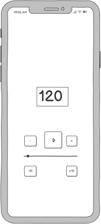
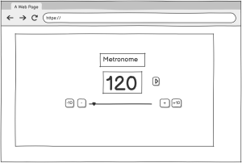

# Metronome

## Introduction.
A metronome is a device which repeats a steady sound to help musicians play in time. Typically the user can adjust the speed (aka tempo) according to their need. More advanced versions give the user control over other parameters.

The impetus for this project was my own desire for a metronome capable of playing at speeds higher than existing freely available models for use in my own musical practice. It was also an opportunity to implement many of the programming and planning skills I have learned.

# Planning

## Strategy
This project would be implemented usingog an agile methodology, and a plan was constructed accordingly. User stories were collected. Most of these were based on what I wanted in a metronome, others were based on various internet postings. Each of these issues would be addressed by adding features to the app. The design was to use mobile first design to support musicians practicing away from a PC. Wire frames were produced to visualise the layout of the app and a basic colour scheme was decided upon.

## Scope
User issues were collected and added to a [Kanban Board](https://github.com/users/ewradcliffe/projects/10/views/1). Issues were graded according to the MoSCoW method:

- Must have: Features without which the project will not work.

- Should have: Features not essential to the functioning of the project, but will add significant value to the project.

- Could have: Features which may be useful, but will not add as much value to the site.

- Won't have: Features which will not be part of the iteration of development.

## Structure

The metronome was structured to be as intuitive as possible to operate. Wire frames were prepared to conceptualise the overall placement of features. Symbols from Font Awesome were chosen for interactive components such as buttons to support users with different languages. Colour would be used to demarcate different sections of the UI. A header and footer would be used to frame the UI. Additional components could be added to these at a later stage of development.

#### Mobile View.  

  
#### Large screens  

## Skeleton

## Surface

## Testing

## Validation

## Technologies

## Deployment

## Future development

## Credits
- The project was based on a template produced by the [Code Institute](https://github.com/Code-Institute-Org/ci-full-template).

- Wire Frames produced in [balsamiq](https://balsamiq.com/).

- Icons from [Font Awesome](https://fontawesome.com/).

- Font from [Google Font](https://fonts.google.com/).

- Colour scheme planned with [colorffy](https://colorffy.com/).
## Gitpod Reminders

To run a frontend (HTML, CSS, Javascript only) application in Gitpod, in the terminal, type:

`python3 -m http.server`

A blue button should appear to click: _Make Public_,

Another blue button should appear to click: _Open Browser_.

To run a backend Python file, type `python3 app.py` if your Python file is named `app.py`, of course.

A blue button should appear to click: _Make Public_,

Another blue button should appear to click: _Open Browser_.

By Default, Gitpod gives you superuser security privileges. Therefore, you do not need to use the `sudo` (superuser do) command in the bash terminal in any of the lessons.

